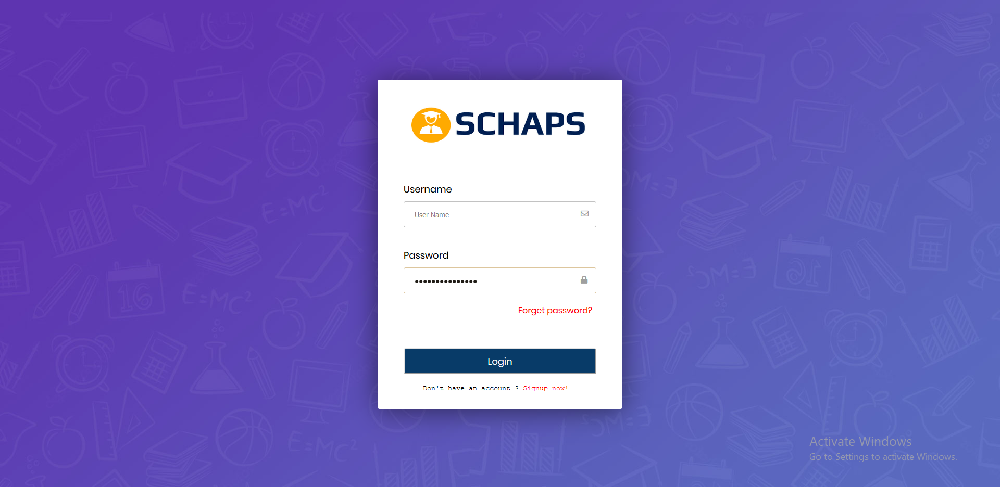
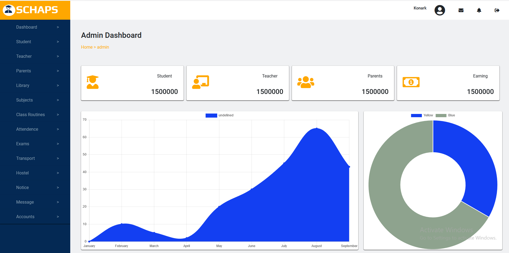
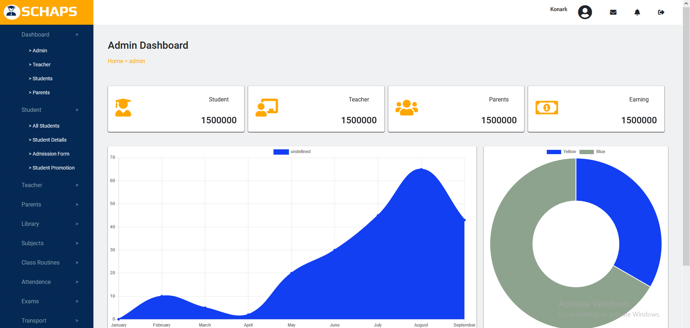
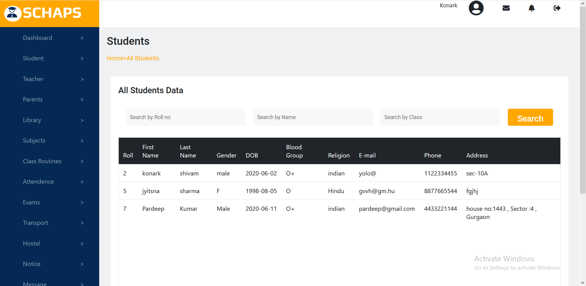
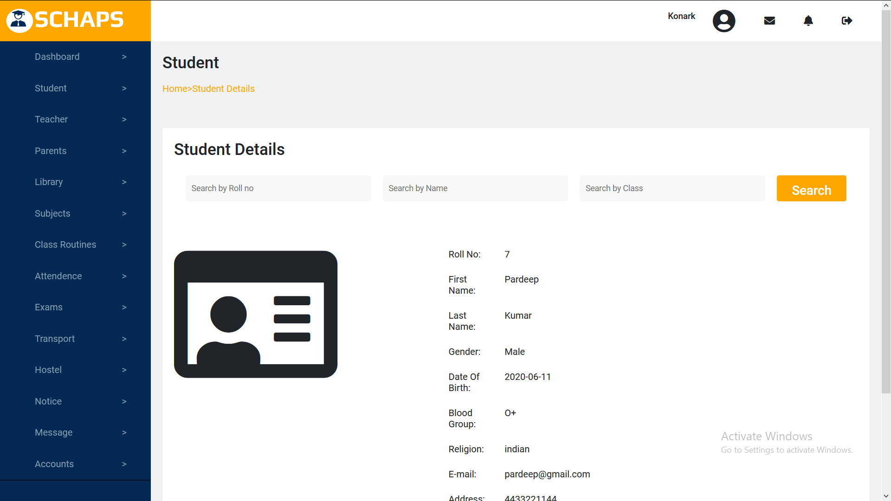
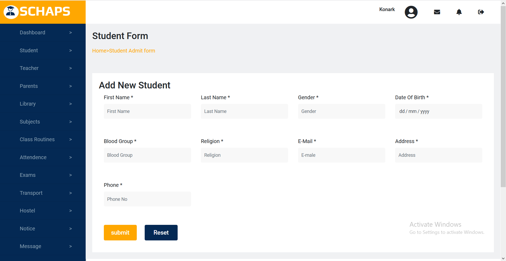
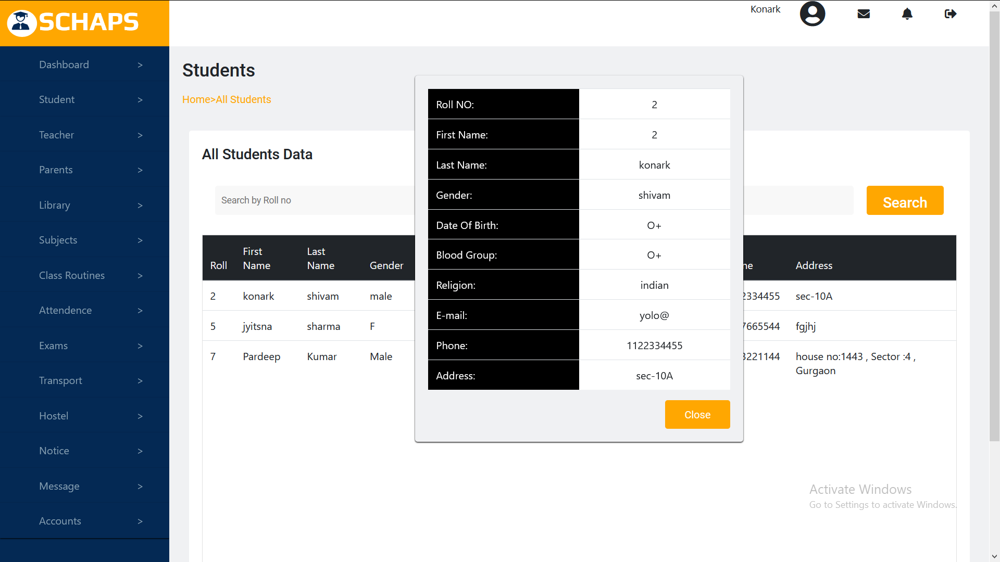

# This is my project on school management system
Technology used:
*	HTML
*	CSS
*	PHP
*	JQUERY
*	JAVASCRIPT

Screenshots:
* Login-page

 

* Dashboard for admin

 

* Sub-menu

 

* All-students

 

* Student-details

 

* Admission-form

 

* Searching particular student using roll no

 
\
